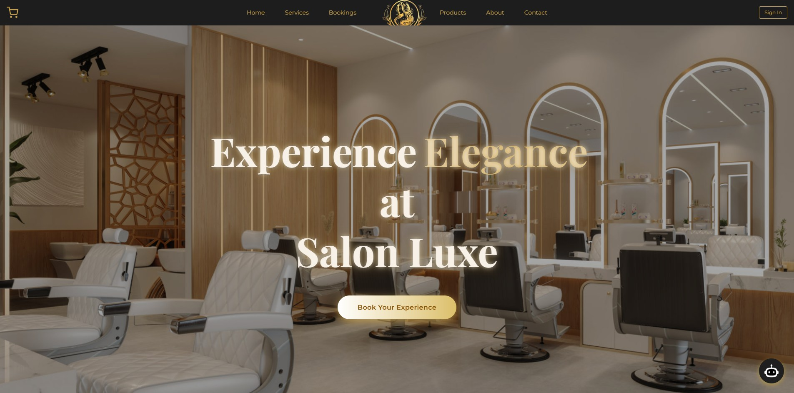

# Salon Luxe – Next.js Project

Salon Luxe is a modern, beautifully designed next-gen website for a luxury hair salon. Created to emphasize both visual sophistication and robust technical capabilities, this site showcases my growth as a front-end developer with Next.js and modern design tools.

## Table of contents

- [Overview](#overview)
  - [Screenshot](#screenshot)
  - [Links](#links)
- [My process](#my-process)
  - [Built with](#built-with)
  - [What I learned](#what-i-learned)
- [Author](#author)

## Overview
Salon Luxe is a professional website for a luxury hair salon. I rebuilt this site to demonstrate my growth as a developer and to incorporate advanced features like authentication and an AI chatbot. Salon Luxe delivers an elegant and user-friendly digital experience, blending salon services with curated product selections—all powered by a sleek, professional interface.

Key features include:

• Hero section with video background 🎥

• Google Sign-In Authentication 🔑

• AI-powered Chatbot integration 🤖

• Booking forms 🗓️

• Product & service showcase pages

• Animations and smooth transitions with Framer Motion

### Screenshot

### Links

- New Site URL: [Salon Luxe (NEW)](https://salonluxelit.vercel.app/)
- Old Site URL: [Salon Luxe (OLD)](https://lit-97.github.io/hair-salon-website/)

## My process
I started by planning the site structure and designing reusable components for pages like About, Contact, and Products. Then I:

1. Set up a Next.js project with TypeScript.

2. Built reusable React components for sections, cards, buttons, and forms.

3. Integrated Firebase for authentication and data management.

4. Added AI chatbot functionality for user interaction.

5. Optimized images and video backgrounds for a polished visual experience.

6. Deployed the site to Vercel for production-ready hosting.

### Built with

- Next.js

- TypeScript

- CSS Modules & Framer Motion (animations)

- Firebase (Authentication & Firestore)

- Vercel (Deployment & Hosting)

- AI Chatbot integration 🤖

- High-quality media assets (optimized images & video)

### Growth & Insights 🌱

- Structuring a complex Next.js project with multiple pages and reusable components

- Implementing Google Sign-In authentication with Firebase

- Integrating an AI-powered chatbot for real-time user engagement

- Optimizing video and image assets for web performance

- Using Framer Motion to enhance UI with animations and smooth transitions

- Managing a production deployment on Vercel

## Author

- Website - [My Portfolio](https://lit-97.github.io/portfolio/)
- GitHub  - [@Lit-97](https://github.com/Lit-97)
